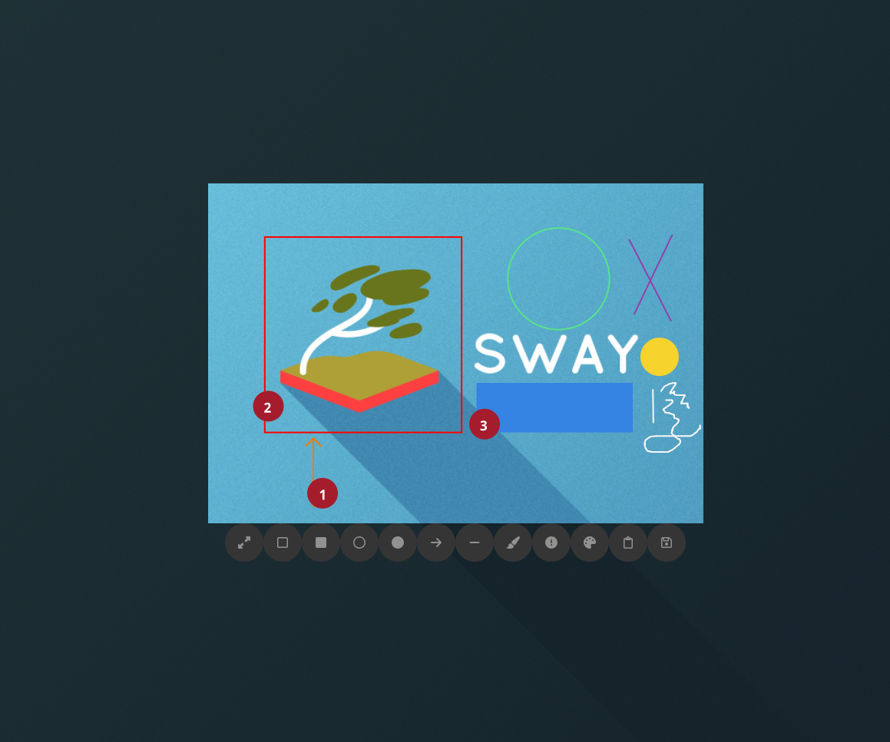

# Rustshot-gtk
Version: 0.3.0

## Description
Simple screenshot program that works on SwayWM. 
Uses Grim.
Not tested on other DEs, feel free to do it.



## Motivation
I couldn't get Flameshot to work on sway (every screenshot was half black). 
I decided to create my own program using Rust and GTK4.

## Requirements
- [rust](https://doc.rust-lang.org/book/ch01-01-installation.html) 
- fontawesome
```{bash}
sudo dnf install fontawesome-fonts-all
```
- grim 

```{bash}
sudo dnf install grim
```

## Installation
Clone this repo 

```{bash}
git clone https://github.com/sebastiano123-c/rustshot-gtk.git
```

Compile and save to `~/.local/bin` 
```{bash}
cd rustshot-gtk
cargo build --release && cp ./target/release/rustshot-gtk ~/.local/bin 
```

Add in `~/.config/sway/config` to display the program in fullscreen
```{bash}
# bind key (change to whatever key bind you prefer)
bindsym Shift+$mod+s exec $take_screenshot

# opens in fullscreen
for_window [app_id="rustshot-gtk"] border pixel 0, floating enable, fullscreen disable, move absolute position 0 0
```

## TODO
For version 0.4.0
- create a settings button in the toolbox to adjust the brush, arrow, and lines width and size
- add enumerated squares
- add pixelated square boxes
- add a way to catch eye attention when fullscreen is enabled.
- add a button the toggle fullscreen back to previous size

## NOT SO IMPORTANT FIXES
- add the opportunity to draw screenshot area continuously (Not really important, probably will not be implemented)
- reduce the toolbox icons size (I cannot go below 50px because the min size is 50 for buttons, probably will not be implemented)

## Tested on
- SwayWM
