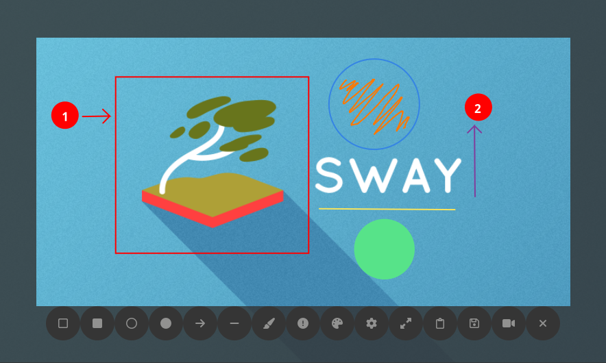

# Rustshot-gtk
Version: 0.6.0

## Description
Simple screenshot program that works great in SwayWM.
It uses Grim. AH! It also supports screen recording!
Tested also in KDE.
Feel free to test it in other DEs or WMs!



## Motivation
I couldn't get Flameshot to work on sway (every screenshot was half black).
I decided to create my own program using Rust and [`gtk4-rs`](https://github.com/gtk-rs/gtk4-rs) library.

## Features
Version 0.6:
- Take screenshots and copy to clipboard;
- Take screenshots and save to file;
- Minimal screen recording;
- Annotations:
    - Boxes and circles;
    - Arrows and lines;
    - Numbered annotations;
    - Free-hand writing;
- Possibility to change annotations colors and sizes;
- Custom styles in the `styles/` folder (remember to change also the `src/constants.rs` file)

## Requirements
- [rust](https://doc.rust-lang.org/book/ch01-01-installation.html)
- fontawesome, grim, wf-recorder:
```{bash}
sudo dnf install fontawesome-fonts-all grim wf-recorder
```

## Installation
Clone this repo

```{bash}
git clone https://github.com/sebastiano123-c/rustshot-gtk.git
```

Compile and save to `~/.local/bin`
```{bash}
cd rustshot-gtk
cargo build --release && cp ./target/release/rustshot-gtk ~/.local/bin
```

Add in `~/.config/sway/config` to display the program in fullscreen
```{bash}
# bind key (change to whatever key bind you prefer)
bindsym Shift+$mod+s exec $take_screenshot

# opens in fullscreen
for_window [app_id="rustshot-gtk"] border pixel 0, floating enable, fullscreen disable, move absolute position 0 0, focus
```

## TODO
For version 0.6.1
- add the video recording with wf-recorder:
    - add a help window that says how to exit the recording (by pressing 'esc' for example)
    - is it possible to have better resolution?
    - is it possible to move the frame when moving the screen shot box? (probabily not with wf-recorder)
    - add recording settings in the toolbox settings
    - preferable to use ffmpeg (hope so)

For version 0.7.0
- add text on screenshot feature
- add pixelated square boxes
- move the toolbox across the screen when in fullscreen

For version 1.0
- create a standalone rustshot-gtk widget

## NOT SO IMPORTANT FIXES
- add the opportunity to draw screenshot area continuously (Not really important, probably will not be implemented)
- reduce the toolbox buttons size (I cannot go below 50px because the min size is 50 for buttons, probably will not be implemented)
- add a way to catch eye attention when fullscreen is enabled (now that the toolbox buttons are a lot, probably useless)
- add a button the toggle fullscreen back to previous size (is this really useful?)

## Tested on
- SwayWM
- KDE Plasma 6.5

## Known issues
- In KDE Plasma the menu bar is excluded from the screenshot
- Screen recorder button looses the background color when pressed.
